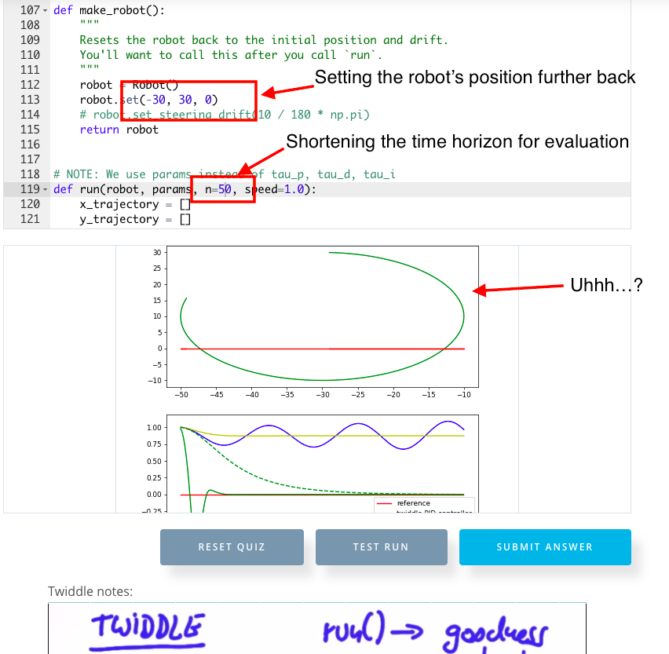

# CarND-Controls-PID
Self-Driving Car Engineer Nanodegree Program

Hello there, and welcome to my repo for implementing a PID controller to control a vehicle, running inside Udacity's simulator.

Here I list some of the criteria for this project, as well as my reflections and general thoughts on it.

## Describe the effect each of the P, I, D components had in your implementation.

NB: Note that the below videos use the final coefficients of the steering controller, with the other two switched off. The final controller is a PD controller with Kp = 0.3 and Kd = 5.0.

The PID controller is a very simple control algorithm (or controller) that is an instance of _closed loop control_, or _feedback control_. This means that the output is fed back in as part of the input to what is commonly referred to as the _plant_ (in our case, the vehicle), meaning the controller can adjust itself based on how it is performing, typically done so with reference to a cost function. In this case, the cost function is the cross-track error (CTE), which is the vector distance between the desired _reference trajectory_ and the actual trajectory.

The PID controller is hugely popular because it is extremely simple, with a myriad of benefits following on from this. In our case it takes in an input error, uses this error directly (the 'proportional' term, 'P'), takes its integral, or the accumulated error('I'), and also its derivative, or the rate at which the error is changing ('D'). These three terms each have weights which reflect how strongly they influence the final result. Multiplying each term by its weight and summing the results gives the output of the plant.

The proportional term reflects the 'eagerness' of the plant to minimise the error. Left unchecked as the only term used by the controller, in our case it causes the vehicle to steer towards the reference trajectory, overshoot, turn, and repeat, ad infinitum. This behaviour, assuming constant speed, leads to increasing divergence over time before eventually stablising at a highly sub-optimal state. This is shown in the below video, where the vehicle aims straight at the centre of the road before trying to compensate as soon as it overshoots.

[P controller](./p_controller.mov "P controller")

The integral term eliminates bias. This is not the same as the proportional term! Here, we have a difference of the integral term _accumulating_ error, so it acts over a longer time-span. In particular, it is effective at compensating for potential biases in the plant itself. For example, if the car steers slightly to the left, the integral term would compensate for this bias in addition to aiming towards the reference trajectory. In our case, the vehicle does not exhibit any particular bias, so this parameter was left unused. The vehicle overshoots as per the previous video, but at a faster rate given the rapid accumulation of error on approach.

[I controller](./i_controller.mov "I controller")

The derivative term dampens the response and introduces a degree of _inertia_. This is what enables the vehicle to soften its entry and turn into the reference trajectory rather than blindly blast through it. This term is _very_ important since it calms down the otherwise frenetic behaviour exhibited by the other two controllers. However, on its own it is useless, since if we start in a sub-optimal state, the vehicle would maintain it, because to do otherwise implies a change in error - and the derivative controller attempts to _minimise_ the change in error, so of course the vehicle is stranded. It just moves weakly in parallel with the reference trajectory until it eventually veers off by the first proper corner. I had initially thought it wouldn't move at all, but of course I forgot that it would move with constant throttle.

[D controller](./d_controller.mov "D controller")

## Student discusses how they chose the final hyperparameters (P, I, D coefficients). This could be have been done through manual tuning, twiddle, SGD, or something else, or a combination!

This bit makes me cross. The simulator promotes a very clumsy workflow and compiling C++ repeatedly does not help. Both of these issues are especially ill-suited to rapid-style iteration over different parameters. Although one could try writing parameter search algorithms, they do not gel well at all with the control loop of the simulator.

I tried to write code that reset the vehicle back at its starting position if the CTE became too high (if the vehicle acquires a CTE with an absolute value of 3.0 or more, the car is basically off the track). Likewise if the car passed a starting line. Annoyingly, neither of these things are viable. The latter because you would have to have the vehicle's coordinates to check that it crossed the line, and you can't (I tried, you really can't unless you use the MPC environment). The former is even more annoying because resetting the simulator appeared to involve a degree of latency, so you effectively double-count and the variables don't update in the main loop properly. Even after forcing the current thread to sleep for a few seconds didn't solve this. I left the attempted code in to give an idea of what I tried to do, commented out.

I also tried using `ctypes` between the C++ PID code and the code in Sebastian's lesson, to essentially do the project in Python but have the C++ PID controller code. `ctypes` is the sole library for interfacing between C/C++ code and Python code that is officially supported by the CPython implementation (read, the canonical Python implementation). Again, this was to give myself more flexibility and faster prototyping than if it were in the simulator. While challenging, I thought this was a useful exercise for me and is good to know for future reference.

Alas, that didn't work particularly well either when I tried running it on different scenarios, being a straight line, a circle, and a sinusoid. I'm not sure if I set up the scenarios and their associated CTE functions properly (the PID controller, loaded from C++ via the `ctypes` interface, is definitely working correctly though). I suspect not, although even Sebastian's Python example can be broken easily and in a similar manner to how mine get broken (see below). This says a lot more about how brittle the PID controller is, as well as the tendency of the twiddle algorithm to get stuck in local minima, than a reflection on Sebastian's part to be fair. It did teach me a fair bit about how time horizons also affect the evaluation of PID controllers, though.



(The above is achieved by setting n=50 and the position of the robot far away enough from the reference trajectory)

So what did I do? You guessed it - manually tune. Absolutely gutted I couldn't do more. Some people used twiddle to refine from a base standard of manually tuning, but I figured it was a _TON_ of pain on my computer (I swear it sounds like it'll take off whenever it even imagines running that simulator) for incredibly little gain, so I didn't bother at that point. Fittingly, using near-identical parameters and using the response of the PID controller for the steering as input, a PID controller for the throttle was also used, albeit with less smooth behaviour than with a default throttle.

I've been led to believe that using a multitude of controllers, even for the same input/output variables, can be beneficial to tackle different scenarios, such as being smoother when near the line, more aggressive angles if veering further away. I didn't do this, but I feel that at that point you're probably better off using an algorithm that is simply more powerful to start with - the Model Predictive Controller, which I'll be tackling next.

Final video using the manually tuned parameters below, featuring both PD (or basically PD) controllers for steering and throttle. Note that I used no integral term for the latter, since I am taking the absolute value of the steering as the input and so it would grow indefinitely, leading to frankly ridiculous behaviour. A word of note: although the car does appear to get very close to the edge at around 0:41, it does not leave the driveable portion of the track (which I would have defined as actually having a wheel on the kerb or worse). With a reference velocity of 0.5, the car is smoother and is less ambiguous in completing a lap.

[Final PD controllers](./final_pd_controllers.mov "Final PD controllers")

---

## Dependencies

* cmake >= 3.5
 * All OSes: [click here for installation instructions](https://cmake.org/install/)
* make >= 4.1(mac, linux), 3.81(Windows)
  * Linux: make is installed by default on most Linux distros
  * Mac: [install Xcode command line tools to get make](https://developer.apple.com/xcode/features/)
  * Windows: [Click here for installation instructions](http://gnuwin32.sourceforge.net/packages/make.htm)
* gcc/g++ >= 5.4
  * Linux: gcc / g++ is installed by default on most Linux distros
  * Mac: same deal as make - [install Xcode command line tools]((https://developer.apple.com/xcode/features/)
  * Windows: recommend using [MinGW](http://www.mingw.org/)
* [uWebSockets](https://github.com/uWebSockets/uWebSockets)
  * Run either `./install-mac.sh` or `./install-ubuntu.sh`.
  * If you install from source, checkout to commit `e94b6e1`, i.e.
    ```
    git clone https://github.com/uWebSockets/uWebSockets 
    cd uWebSockets
    git checkout e94b6e1
    ```
    Some function signatures have changed in v0.14.x. See [this PR](https://github.com/udacity/CarND-MPC-Project/pull/3) for more details.
* Simulator. You can download these from the [project intro page](https://github.com/udacity/self-driving-car-sim/releases) in the classroom.

There's an experimental patch for windows in this [PR](https://github.com/udacity/CarND-PID-Control-Project/pull/3)

## Basic Build Instructions

1. Clone this repo.
2. Make a build directory: `mkdir build && cd build`
3. Compile: `cmake .. && make`
4. Run it: `./pid`. 

Tips for setting up your environment can be found [here](https://classroom.udacity.com/nanodegrees/nd013/parts/40f38239-66b6-46ec-ae68-03afd8a601c8/modules/0949fca6-b379-42af-a919-ee50aa304e6a/lessons/f758c44c-5e40-4e01-93b5-1a82aa4e044f/concepts/23d376c7-0195-4276-bdf0-e02f1f3c665d)

## Editor Settings

We've purposefully kept editor configuration files out of this repo in order to
keep it as simple and environment agnostic as possible. However, we recommend
using the following settings:

* indent using spaces
* set tab width to 2 spaces (keeps the matrices in source code aligned)

## Code Style

Please (do your best to) stick to [Google's C++ style guide](https://google.github.io/styleguide/cppguide.html).

## Project Instructions and Rubric

Note: regardless of the changes you make, your project must be buildable using
cmake and make!

More information is only accessible by people who are already enrolled in Term 2
of CarND. If you are enrolled, see [the project page](https://classroom.udacity.com/nanodegrees/nd013/parts/40f38239-66b6-46ec-ae68-03afd8a601c8/modules/f1820894-8322-4bb3-81aa-b26b3c6dcbaf/lessons/e8235395-22dd-4b87-88e0-d108c5e5bbf4/concepts/6a4d8d42-6a04-4aa6-b284-1697c0fd6562)
for instructions and the project rubric.
